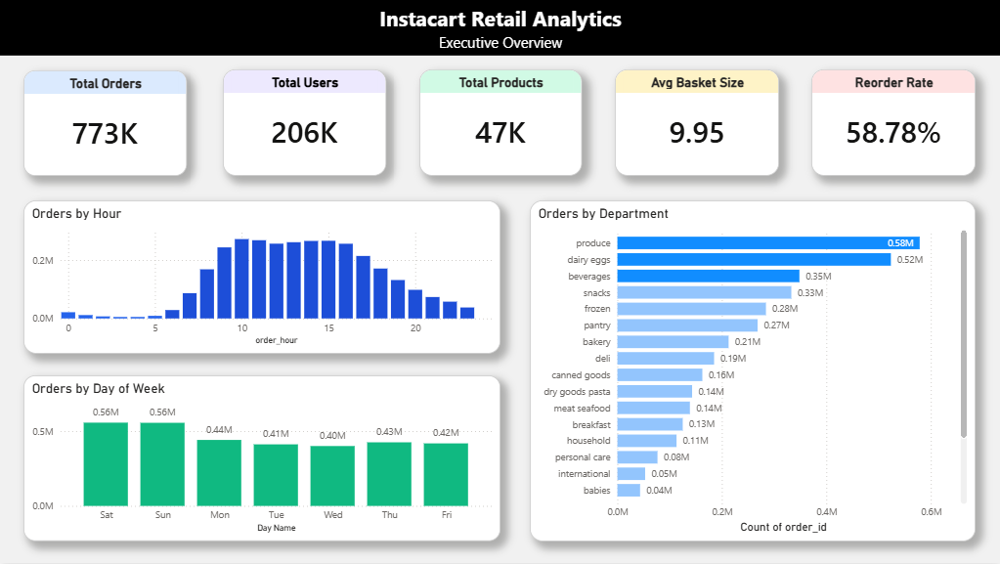
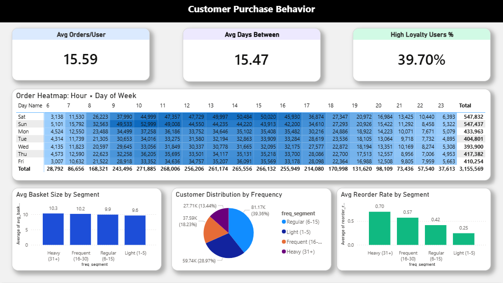
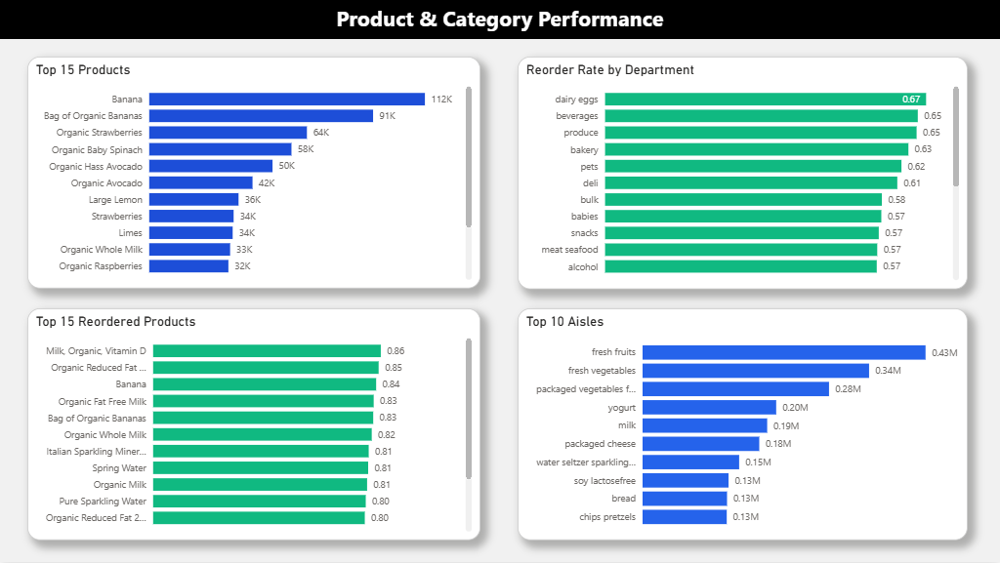
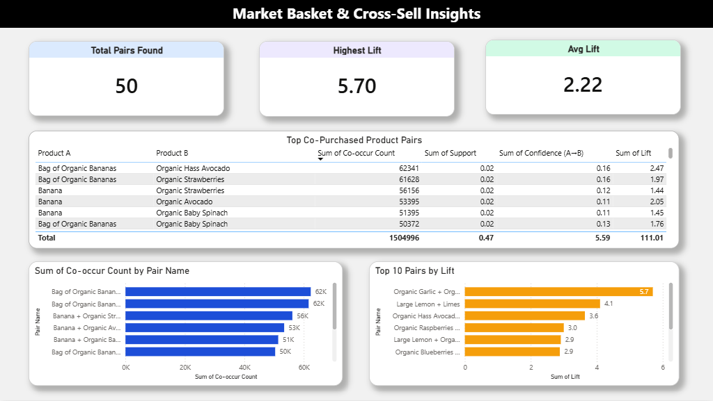

# Instacart Customer Behavior & Market Basket Analytics

> Customer behavior dashboard analyzing **3M+ orders** across **206K customers** and **47K products** to identify cross-sell opportunities and segment-level loyalty patterns



A 4-page interactive Power BI dashboard exploring customer purchasing behavior, product demand patterns, and product co-purchase relationships — built on the Instacart Market Basket Analysis dataset from Kaggle. The work combines Python EDA, SQL analytical queries, and association rule mining (Support, Confidence, Lift) to surface actionable insights for shelf placement, bundle promotions, and customer retention.

---

## Business Questions Answered

| # | Question | Finding |
|---|---|---|
| 1 | When do customers shop? | Weekends (Sat-Sun) drive the most orders; **10 AM** is the busiest hour overall |
| 2 | Who are our power users? | Heavy users (13% of base) deliver **70% reorder rate** vs 25% for Light users |
| 3 | Which products go together? | Organic Garlic + Yellow Onion has Lift **5.7** — strongest co-purchase pair |
| 4 | Where is stockout risk highest? | Dairy Eggs dominates the top reordered list — must-never-stockout category |
| 5 | Does basket size differ by segment? | All segments average ~10 items — loyalty comes from **purchase frequency**, not larger baskets |

---

## Tech Stack

| Layer | Tools |
|---|---|
| **Data Processing** | Python (Pandas, NumPy) |
| **Analytical Queries** | SQL (DuckDB on Colab) |
| **Notebook Environment** | Google Colab |
| **Visualization** | Power BI Desktop |
| **Analytics Techniques** | Market Basket Analysis (Support/Confidence/Lift), Customer Segmentation, KPI Analysis |

---

## Dashboard Preview

### Page 1 — Executive Overview

KPI cards (Total Orders, Users, Products, Avg Basket, Reorder Rate), hourly and daily order patterns, top departments by volume.

### Page 2 — Customer Purchase Behavior

Customer segmentation by order frequency (Light/Regular/Frequent/Heavy), reorder rate by segment, hour × day heatmap, basket size analysis.

### Page 3 — Product & Category Performance

Top 15 products by volume, reorder rate by department, top 10 aisles, top reordered products.

### Page 4 — Market Basket & Cross-Sell Insights

Co-purchased product pairs table, Top 10 pairs by Lift, co-occurrence counts.

---

## Technical Highlights

- **SQL-based KPI pipeline** — analytical queries for reorder rate, segment performance, and pair-level metrics in dedicated `.sql` files
- **Customer segmentation** — 206K users grouped into 4 tiers (Light / Regular / Frequent / Heavy) by lifetime order count, then compared on reorder rate and basket size
- **Frequency-aware reorder rate** — calculated per product and per department to identify must-stock SKUs
- **Market Basket Analysis at 32M-row scale** ⭐ — see below

### Market Basket Analysis at Scale

Computing association rules on 32 million order-line rows requires deliberate filtering to avoid combinatorial explosion in the pair space.

**Approach:**

1. **Filter to top 100 products by order volume** — captures the majority of transaction value while keeping the pair search space manageable (100 × 100 = 10K pairs vs 47K × 47K = 2.2B without filtering)
2. **Compute three association metrics per pair**:
   - **Support** = P(A ∩ B) — how often both products appear together
   - **Confidence** = P(B | A) — given A is in the basket, probability B is too
   - **Lift** = P(A ∩ B) / (P(A) × P(B)) — strength of the relationship vs random chance

```python
# Core formula — see notebook for full implementation
support = (a_and_b_count) / total_orders
confidence_a_to_b = (a_and_b_count) / a_count
lift = support / (p_a * p_b)
```

**Lift > 1** indicates products are purchased together more than chance would predict.

Top result: **Organic Garlic + Yellow Onion at Lift 5.7** — these are purchased together far more than random co-occurrence would suggest, directly informing shelf-placement and bundle-pricing decisions.

---

## Business Recommendations

| Recommendation | Based on |
|---|---|
| Place **Garlic + Onion** adjacent on shelves | Lift 5.7 — strongest pair |
| Bundle **Lemon + Limes** as a citrus pack | Lift 4.1, high confidence |
| Schedule promotions **Saturday–Sunday 9 AM – 3 PM** | Peak ordering window from heatmap |
| Target **Light users (29% of base)** with reminders at ~14-day intervals | Average reorder cycle ≈ 15.5 days |
| Treat **Dairy Eggs SKUs** as zero-stockout priority | Highest reorder rate by department (0.67) |

---

## Repository Structure

```
instacart-retail-analytics/
├── README.md
├── notebook/
│   └── instacart_analysis.ipynb     # EDA, segmentation, market basket
├── data/
│   └── processed/                   # Cleaned CSVs for Power BI
├── sql/
│   ├── 01_data_join.sql             # Analytical dataset creation
│   ├── 02_kpi_queries.sql           # Business KPIs and metrics
│   └── 03_reorder_analysis.sql      # Reorder & segmentation queries
├── powerbi/
│   └── instacart_dashboard.pbix     # Power BI file (interactive)
└── assets/                          # Dashboard screenshots
    ├── page1_executive_overview.png
    ├── page2_customer_behavior.png
    ├── page3_product_category.png
    └── page4_market_basket.png
```

---

## How to Reproduce

**Prerequisites:** Python 3.8+, Power BI Desktop, Jupyter (or Google Colab)

1. **Download raw data** from [Instacart Market Basket Analysis on Kaggle](https://www.kaggle.com/c/instacart-market-basket-analysis/data) — 6 CSV files including orders, products, departments, aisles
2. **Run the notebook** `notebook/instacart_analysis.ipynb` end-to-end to regenerate the processed datasets
3. **Open the dashboard** `powerbi/instacart_dashboard.pbix` in Power BI Desktop

---

## Data Source

[Instacart Market Basket Analysis](https://www.kaggle.com/c/instacart-market-basket-analysis/data) (Kaggle)

| Table | Rows | Description |
|---|---|---|
| orders | 3,421,083 | Order-level data with timing info |
| order_products__prior | 32,434,489 | Line items for prior orders |
| products | 49,688 | Product names with category mapping |
| aisles | 134 | Aisle dimension |
| departments | 21 | Department dimension |

> Raw data files are not included due to size. Download from Kaggle and place in `data/raw/`.

---

## Author

**Gorawit Khovintasets**

Computer Engineering (AI Specialization) — SIIT, Thammasat University

[GitHub](https://github.com/Gorawit2002) · [Portfolio](https://gorawit-portfolio.vercel.app/)